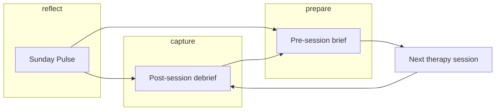
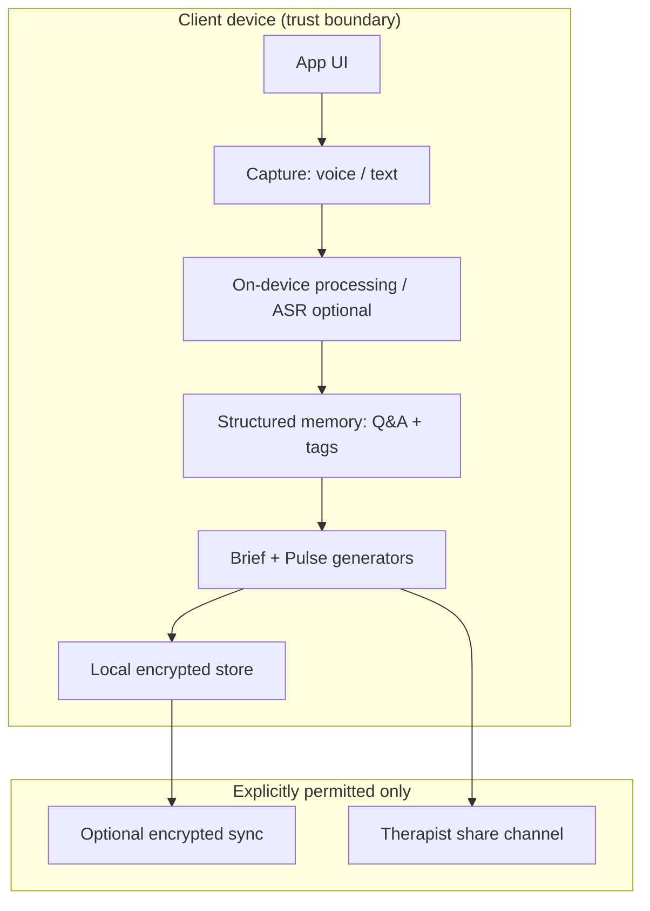

# Mend — Between-session memory for therapy

> *“Your therapist remembers the session. Mend remembers the week.”*

**Mend** is a product concept and working MVP for a **between-session memory layer**: a privacy-first companion that helps people **capture** what happened after therapy, **prepare** intentionally before the next session, and **see patterns** they cannot spot alone—including early signals when old themes reappear.

This repository is submitted for **Product Arena 3.0**. It reflects how I think as a **product manager**: grounding the build in **market and user gaps**, a **coherent journey**, a **closed value loop**, and a **clear data story**—not only UI and code.

---

## How I think about this problem (PM lens)

### Market gap: the “Wednesday problem”

Digital mental health has scaled **access** (teletherapy, chat, apps). It has **not** systematically solved **continuity**: what happens **between** sessions when memory fades, insights scatter, and motivation drops. Users often report:

- **Recall decay** — “I forgot what I wanted to bring up.”
- **Preparation asymmetry** — therapists have notes; clients often have feelings without structure.
- **Pattern blindness** — week-level themes (e.g. shame, performance, rest) rarely surface without deliberate reflection.

That is a **gap in outcomes and engagement**, not only in content libraries. The opportunity is a product that **respects clinical boundaries** while **owning the client’s narrative arc across time**.

### Gap in products that address “between sessions” today

| Category | What they do well | Where they leave a gap |
| -------- | ------------------- | ------------------------ |
| **Generic journaling / mood apps** | Habit, low friction | Not **therapy-aware**; weak link to **next session** and **therapist-aligned prep** |
| **EHR / therapist tools** | Clinical record | **Not client-owned**; not designed for **client-side capture** right after session |
| **Wellness / meditation** | Calm, breadth | Seldom tied to **specific therapeutic themes** or **regression signals** from the client’s own words |
| **Some “AI therapy” positioning** | Novelty | **Trust and consent** are fragile; users fear background recording and data misuse |

**Mend’s wedge:** opt-in, **session-adjacent**, **client-controlled** memory—structured enough for **briefs** and **patterns**, human enough for **trust**.

---

## Product overview

Mend sits **next to** the therapy platform the user already uses (here mocked as **YourDOST**). It does not replace a therapist; it **extends the client’s ability to show up prepared and self-aware**.

**Design principles baked into the MVP**

1. **Explicit consent** — onboarding is a consent architecture, not a checkbox wall.
2. **Opt-in capture** — debrief is user-started; no ambient listening story.
3. **Actionable outputs** — debrief → brief → pulse are **three concrete artifacts**, not a feed.

---

## User journey: from discovery to habit

| Stage | What happens | PM intent |
| ----- | -------------- | -------- |
| **Discovery** (`/`) | User sees their familiar app surface; Mend appears as a **recommended card** with clear value and “Try free →”. | Meet users **in context**; reduce cold-start abstraction. |
| **Onboarding** (`/onboarding`) | Four steps: promise, setup, **controls**, therapy context. | Build **trust before data**; set expectations on privacy and control. |
| **Home** (`/home`) | Session card, debrief CTA, memory jar, pulse teaser. | **Single hub** that routes to each feature with obvious next actions. |
| **Debrief** (`/debrief`) | Five guided prompts, voice-first with optional typing. | **Capture while salient**; structure raw experience into retrievable memory. |
| **Brief** (`/brief`) | Five bullets summarizing themes for **next session**; share affordance. | **Close the loop** into the next clinical conversation. |
| **Pulse** (`/pulse`) | Weekly digest: recurring pattern, shift point, **regression alert**; “Add to brief”. | **Week-level intelligence**; nudge when themes recur. |

**End-to-end flow (one sentence):**  
Discover Mend → consent and configure → land on home → **debrief** after a session → review **brief** before the next one → scan **pulse** on Sunday → optionally push insights into the next brief—**repeat each cycle**.

---

## The three features—and why they matter

### 1. Guided debrief (Feature 1)

**What it is:** Five prompts (emotion, belief, pattern, commitment, open loop) with a **voice-first** capture and completion state.

**Impact:** Converts fuzzy post-session memory into **labeled, searchable answers** that downstream features can use—without asking users to “journal more” in the abstract.

### 2. Pre-session brief (Feature 2)

**What it is:** A structured, five-bullet **brief** aligned to the upcoming session, with a **share** path to the therapist (mocked UI).

**Impact:** Reduces **“I forgot what mattered”** and increases **session yield**—the same hour can go deeper when the client arrives with a coherent agenda.

### 3. Sunday Pattern Pulse (Feature 3)

**What it is:** Three insight cards—**recurring pattern**, **shift point**, and **regression detected** (before/after quotes)—plus **add to brief** and confirmation toast.

**Impact:** Surfaces **cross-session structure** and **early warning** when Week-1 language reappears in new words—supporting **self-awareness** and **timely therapist collaboration**.

---

## The correct product loop (retention & value)

Mend is designed around a **weekly clinical-adjacent loop**, not infinite scrolling:



**Why this loop works**

- **Debrief** creates **fresh structured input** after emotional load.
- **Brief** **consumes** that input at the **highest-stakes moment** (pre-session).
- **Pulse** **aggregates** across the week so users feel “Mend saw what I missed.”
- **Regression → Add to brief** explicitly **feeds the next brief**, so insights don’t die in a digest.

**North-star behaviors (how I’d measure success in a real rollout)**

- Debrief completion rate within 24h of session  
- Brief open rate within 24h before session  
- Pulse weekly return + “add to brief” rate  
- Self-reported “felt more prepared” (in-app micro-survey)

---

## Data pipeline (conceptual architecture)

**MVP in this repo:** client-side **mock data** and **Zustand** state to demonstrate flows and UI. **Production intent** below is how I’d describe the pipeline to engineering, trust, and clinical advisors.



**Principles**

1. **Minimize raw audio retention** — process or segment on device where possible; delete per user policy.
2. **Structured artifacts first** — store **prompts, transcripts summaries, tags**, not only blobs.
3. **Therapist share is outbound and explicit** — user initiates; no silent exfiltration.
4. **Pattern models** — regression detection should be **explainable** (quotes, time windows) and **conservative** in language to avoid iatrogenic alarm.

---

## Repository layout

| Path | Purpose |
| ---- | ------- |
| `mend-app/` | React + Vite application, tests, and deployment config |

All install, dev, test, and build commands run from **`mend-app/`**.

---

## Development

```bash
cd mend-app
npm install
npm run dev
```

Open **http://localhost:5173**.

### Tests

```bash
cd mend-app
npx vitest run tests/unit/
npx vitest run tests/integration/
npx vitest run
```

### Production build

```bash
cd mend-app
npm run build
```

Output: `mend-app/dist/`. **Vercel:** set project root to `mend-app` (or deploy from that directory); `vercel.json` includes SPA rewrites.

---

## Tech stack

- React 18, Vite, Tailwind CSS v3  
- Framer Motion, React Router v6  
- Zustand  
- Vitest + React Testing Library  

---

## Privacy (product promise)

Mend is framed as **opt-in only**, with **on-device** processing as the default story and **no background recording**. Any cloud or share path must remain **user-initiated** and **transparent** in a production system.

---

## Author

Built to demonstrate **product thinking** (problem, loop, metrics mindset, data/privacy framing) and **execution** (shippable MVP, tests, deployable artifact) for **Product Arena 3.0**.
